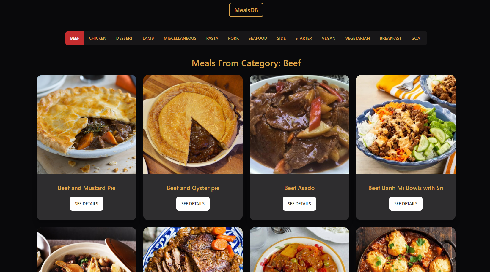
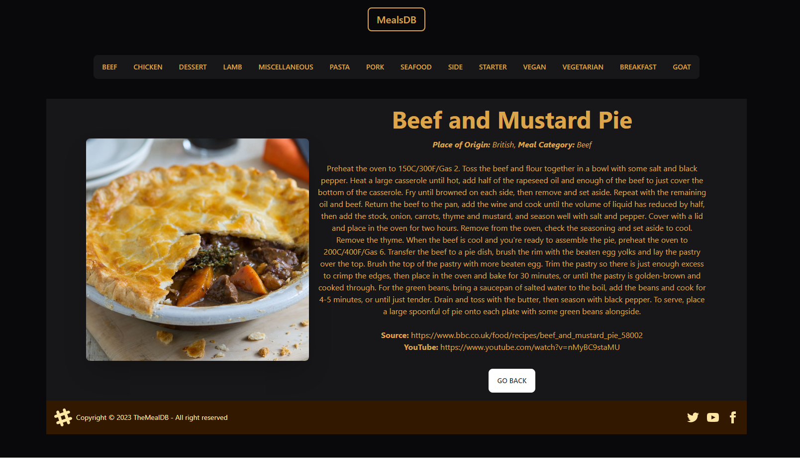

# React + Vite

### Built using React Router and Free `TheMealDB` API

This is a small, but feature-rich react app that keeps track of different meals and recipes using React Router.

### Features:

- Click on different categories to see meals in that category.
- Click on a specific meal you like to view its details, along with a recipe.
- Come back to the previous page using the Go Back button or to the main page using the MealsDB button at the top of the navbar.

Live Server: https://awesome-meals.surge.sh/
